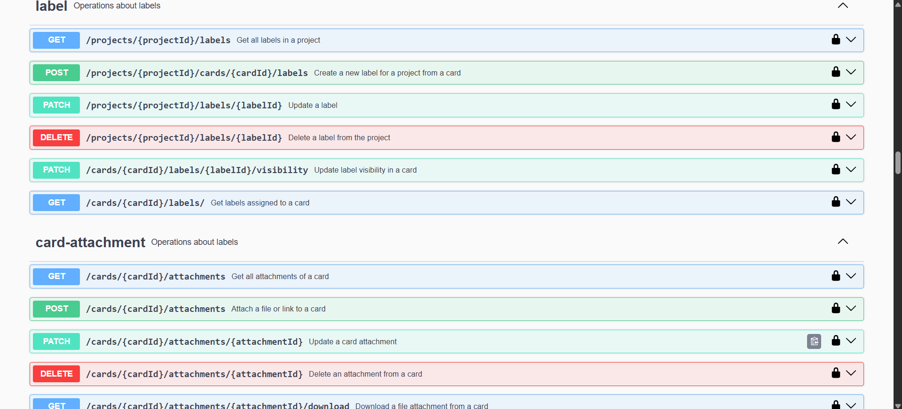

# Autumn(Trello-like API)

Autumn is an API for collaborative project management inspired by Trello. It is built using **Node.js, Express.js, PostgreSQL, JWT authentication, Redis for caching, Sequelize ORM, BullMQ, and Docker**. The project follows **Clean Architecture, and Domain-Driven Design (DDD)** to ensure maintainability and scalability. It features authentication management, roles, teams, tasks, attachments, and more.

## Documentation API
- **Swagger UI** available at: /api-docs in the browser

Here you can see a preview of the Swagger documentation:



## Technologies Used
- **Node.js** - Backend runtime
- **Express.js** - Web framework
- **PostgreSQL** - Database
- **Sequelize ORM** - Object-Relational Mapping
- **Redis** - Caching system
- **JWT Authentication** - Secure authentication(Access/Refresh tokens)
- **Passport.js** - Authentication middleware
- **Docker** - Containerized environment
- **Winston & Morgan** - Logging and performance monitoring
- **Nodemailer** - Email service
- **Joi** - Data validation
- **Express-rate-limit** - Rate limiting middleware
- **BullMQ** - Task queue for sending emails in the background
- **Cloudinary** - Host files and images for free
- **Swagger** - API documentation
- **PM2** - Management of production processes

## Authentication System
Autumn implements a **JWT-based authentication system** with access and refresh tokens. A key feature of this system is **auto-authentication**: as long as the refresh token remains valid, the user session remains active indefinitely. However, if the user does not log in for **15 consecutive days**, the refresh token will expire and and re-authentication will be required.

## Project Structure
The project follows **Clean Architecture and Domain-Driven Design (DDD)** principles. The `api/src/` directory is structured as follows:
```
api/src/
├── application/
│   ├── dtos/
│   ├── services/
│   └── use-cases/
├── domain/
│   ├── repositories/ (contracts)
│   ├── entities/
│   └── value-objects/
├── infrastructure/
│   ├── adapters/
|   ├── queues/
│   ├── repositories/ (implementations)
│   └── store/ (DB, ORM, cache configuration)
├── interfaces/
│   ├── controllers/
│   ├── middlewares/
│   ├── routes/
│   └── schemas/
├── config/ (environment variables)
└── utils/ (helpers)
```

## 📦 Features

- ✅ Authentication with JWT (access/refresh tokens)
- ✅ Validation with Joi
- ✅ Global Error Middleware
- ✅ Authentication and authorization middleware
- ✅ Clean Architecture + DDD
- ✅ Full CRUD::
- Users (with recursive deletion)
- Workspaces, Projects, and Teams
- Lists, Cards, Checklists, and Items
- Members, Tags, and Attachments
- ✅ User roles by context belonging to workspaces, projects or teams: `owner`, `admin`, `member`
- ✅ Roles per subscription plan: `basic`, `premium`
- ✅ Assigning/de-assigning equipment to projects
- ✅ Securely upload files and images with Cloudinary
- ✅ Secure download via proxy endpoint with streams
- ✅ Message queues with BullMQ for sending emails

---

## 🔐 Authentication and roles

- **JWT Authentication** with refresh tokens managed from Redis and cookies.
- **Subscription plans**:
  - `basic`: Creation and limited membership of workspaces, projects, and teams
  - `premium`: Limited but expanded ability to create and join workspaces, projects, and teams.
- **Hierarchical roles** by entity (`workspace`, `project`, `team`):
  - `owner`: owner (can transfer ownership)
  - `admin`: manage members
  - `member`: You can only contribute to the project with lists, cards, and information within each card, but you cannot manage members or update the project.

---

## The Frontend
Initially, Autumn was designed as a **full-stack** project with a frontend built in **Vanilla JavaScript**. However, as the focus of the project shifted towards **backend development**, the frontend was discontinued. The **`public/`** directory still contains frontend files, but they are no longer maintained or developed further.

## 🧪 Testing

Currently **automated tests are not included**, but functionality has been verified with extensive manual testing.

> Different testing techniques will be implemented soon.

---

## How to Run the Project
### Prerequisites
- **Docker** installed on your machine
- **Node.js** and **npm** installed
- Have a **Redis account** or download a redis image with docker in the .yml file
- Have a **Cloudinary account**
- For email sending to work, you need a **Gmail password**. You can access it at https://myaccount.google.com/apppasswords. It will give you a password like: abcd efg hijkl. Remove the spaces and paste it into the .env file in SMT_PASS.


### Setup and Installation
1. Clone the repository:
   ```bash
   git clone git@github.com:OscarS05/Trello-like-project.git
   cd Trello-like-project
   ```
2. Create a **.env** file based on the `.env.example` provided in the project root
3. Start the services using Docker Compose:
   ```bash
   docker-compose up -d
   ```
4. Install dependencies:
   ```bash
   npm install
   ```
5. Run database migrations:
   ```bash
   npm run migrations:run
   ```
6. Start the development server:
   If you have already registered, can log in successfully and you do not have to send emails:
   ```bash
   npm run dev
   ```

    or,

   If you need user registration with email confirmation:
   ```bash
   npm run pm2
   ```

## Available Scripts
```bash
"scripts": {
  "pm2": "pm2 start ecosystem.config.js",
  "dev": "nodemon api/index.js",
  "start": "node api/index.js",
  "lint": "eslint",
  "migrations:generate": "sequelize-cli migration:generate --name",
  "migrations:run": "sequelize-cli db:migrate",
  "migrations:revert": "sequelize-cli db:migrate:undo",
  "migrations:delete": "sequelize-cli db:migrate:undo:all",
  "environment:status": "sequelize-cli db:migrate:status"
}
```

## ER schema of the database
The file with the ER diagram is located in the root of the project:
 - Trello-like-api-db-schema.drawio
To edit it, install the "Draw.io Integration" extension in VSCode.
If the diagram doesn't display, right-click on the file → "Reopen Editor With" → "Draw.io".


## Project Status
The project is completed.
All backend functionalities have been implemented successfully.
It runs locally with tools like Insomnia or Postman.


## Upcoming implementations

- **Real-time notification system**.
- **Real-time chat for projects using Socket.io**.
- **Comprehensive testing implementation**.

---

**Note**
The authentication system, along with the creation of lists and cards, is part of the Software Analysis and Development Technologist (SENA) certification. The rest of the project was a voluntary and self-taught creation after SENA.

---

## Developer
Oscar Santiago Monsalve

---

## License

[](https://creativecommons.org/licenses/by-nc/4.0/)

